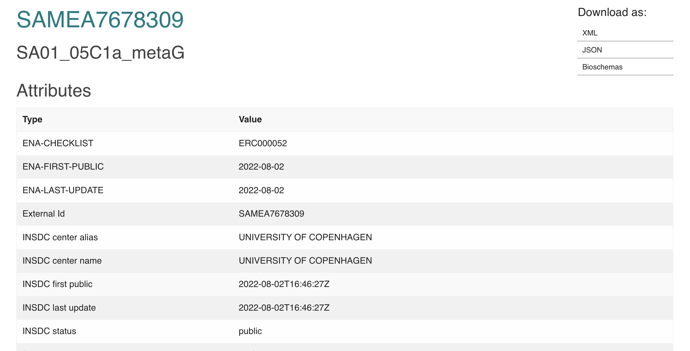
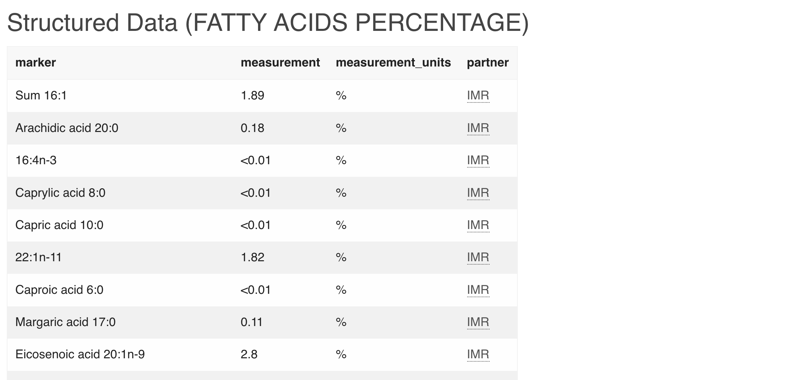

# Practical 1: Uploading raw data to ENA

### Requirements:

We will be using a test Webin account today. Credentials will be shared on the workshop day. 

**Please use this URL at all times https://wwwdev.ebi.ac.uk/ena/submit/webin/login**

#### Programmatic submission
- Web browser
- curl
- Java 1.8 or newer - can be downloaded from: https://java.com/en/download/
- Webin-cli - can be downloaded from: https://github.com/enasequence/webin-cli/releases/download/5.0.0/webin-cli-5.0.0.jar

#### Interactive submission
- Web browser

Note: **All uploads today will be test submissions** and are deleted after 24 hours. You have the option to submit programmatically or interactively for each step.

## ENA

### Register a study

1. Programmatically
- Download the template XML in folder input-data/project.xml and fill in the indicated fields.
- Submit study with the following command:
```curl -u Webin-ID:Webin-PASSWORD -F "ACTION=ADD" -F "PROJECT =@project.xml" "https://wwwdev.ebi.ac.uk/ena/submit/drop-box/submit/"```

2. Interactively

Follow the instructions given here to register a project the same way https://ena-docs.readthedocs.io/en/latest/submit/study/interactive.html

 What is your study ID? Make note of the project accessions for later steps.

### Register a sample 

ENA has many sample checklists available for different datatypes. Checklists are sample metadata fields which can be provided by the user. Each checklist has a set of mandatory fields and optional fields. 

Browse through the available checklists https://www.ebi.ac.uk/ena/browser/checklists

 Is there a particular checklist best associated with your data or other food and nutritional data? Keep this in mind for discussion at the end.

For the purpose of this practical we will use: *ERC000014 - GSC MIxS human associated* OR *ERC000011 - ENA default sample checklist*
You can use input-data/sample_data.tsv OR your own sample metadata to populate the sample fields.

1. Programmatically
- Download the template XML in folder input-data/sample.xml
- Fill in the indicated fields in the XML. Use the tips section below to help you.
- Submit the sample with the following command:
```curl -u Webin-ID:Webin-PASSWORD -F "ACTION=ADD" -F "SAMPLE=@sample.xml" "https://wwwdev.ebi.ac.uk/ena/submit/drop-box/submit/"```

2. Interactively
- Follow the instructions given here https://ena-docs.readthedocs.io/en/latest/submit/samples/interactive.html
  - Select the sample checklist from 'Other checklists' *ENA default sample checklist*
  - Select optional fields of your choice for which you have metadata.
  - Use tips below to help you fill in the metadata.

**Tips**

**Taxon ID: This must be a metagenomic taxid selected from the following list https://www.ncbi.nlm.nih.gov/Taxonomy/Browser/wwwtax.cgi?mode=Undef&id=408169&lvl=3&keep=1&srchmode=1&unlock**

**Use the checklist links to understand the content and format required for each field e.g. https://www.ebi.ac.uk/ena/browser/view/ERC000014**

**Latitude and longitude if not available can be set to *41.11993436402565, 1.2604602827462956* - your current location!**

**Sequencing method if not available can be *Illumina MiSeq***

**Collection date if not available can be today's date**

**If submission fails - take a look at the error log, make required changes and submit again**

 What is your sample ID? Make note of the accession for later steps.


### Register experiment and reads

Test fastq reads that can be used for this step are in input-data/10333.Che.177.huma.fastq.gz.

1. Programmatically
- Download the template manifest in folder input-data/test.manifest
- Fill in required fields specified as 'TODO'. Use tips section below to help you.
- Submit using the following command:
```java -jar webin-cli-5.0.0.jar -context reads -userName Webin-ID -password Webin-PASSWORD -manifest test.manifest -submit -test```

2. Interactively
- Upload FASTQ read files using one of the following methods https://ena-docs.readthedocs.io/en/latest/submit/fileprep/upload.html
- Submit required metadata following these instructions https://ena-docs.readthedocs.io/en/latest/submit/reads/interactive.html. Use the tips section below to help you.

**Tips**

**Use the following rules to select the required metadata for your manifest/csv file https://ena-docs.readthedocs.io/en/latest/submit/reads/webin-cli.html#metadata-validation**

***LIBRARY_SOURCE* must be *METAGENOMIC* or *METATRANSCRIPTOMIC* in order to request analysis with MGnify**

 What accessions are generated?

### Check your submission

Login to the webin portal and check your submission https://wwwdev.ebi.ac.uk/ena/submit/webin/login

You should see a page like this to navigate

*IMAGE TO BE ADDED*

## BioSamples

Our sample metadata contains fields such as blood pressure and heart rate which do not fit into any ENA checklists. This metadata can be added in BioSamples.

Samples submitted to ENA are automatically inhereted in BioSamples with the accession beginning 'SAME'

As we did not generate any real samples today we cannot update any, but an example is provided below.

Updates are submitted to biosamples as stuctured data in json format e.g. 

```
{
 "name": "ERSXXX",
 "accession": "SAMEXXXX",
 "data": [
  {
   "webinSubmissionAccountId" : "Webin-ID",
   "type": "ADDITIONAL METADATA",
   "content": [
    {
     "marker": {
      "value": "Systolic blood pressure"
     },
     "measurement": {
      "value": 110
     }
     "measurement_units": {
      "value": "mm Hg"
     },     
    },
    {
     "marker": {
      "value": "Heart rate"
     },
     "measurement": {
      "value": 54
     },
     "measurement_units": {
      "value": "beats/min"
     }
    }
   ]
  }
 ]
}
```

e.g. https://www.ebi.ac.uk/biosamples/samples/SAMEA7678309 

**These are attributes inhereted from ENA**


**These are attributes added via BioSamples**



